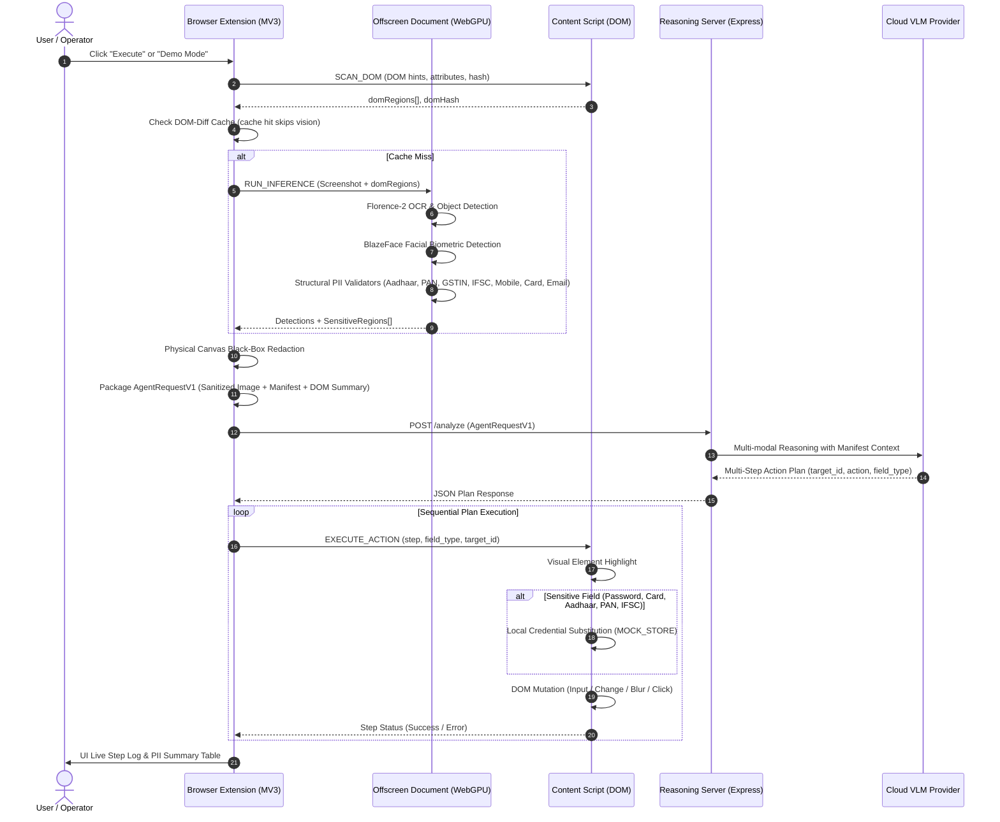

# Solution Whitepaper: Edge-Native Visual Perception & Autonomous Browser Agent with Precision PII Redaction

**Project:** Privacy-Preserving Autonomous Browser Agent  
**Theme:** Smart Automation / Visual Perception & Edge Privacy  
**Target Domain:** Sovereign Enterprise & Public Services Workflows  
**Version:** 0.3.0  

---

## 1. Executive Summary & Problem Statement

Autonomous Vision-Language Model (VLM) browser agents promise to automate complex, multi-step web workflows—from procurement registration to financial reconciliation. However, enterprise and government deployments face an existential roadblock: **data egress privacy risk**. Standard browser agents capture full-resolution raw screenshots and DOM trees, transmitting them directly to third-party cloud inference providers.

When applied to high-sensitivity portals—such as vendor onboarding, financial applications, and identity registries—this conventional architecture transmits high-risk Personally Identifiable Information (PII) to remote servers, violating statutory privacy mandates and exposing organizations to catastrophic regulatory penalties and credential leakage.

This solution presents a **zero-trust, edge-native redaction architecture**. Before any visual frame or DOM context leaves the local device:
1. An on-device perception engine (Florence-2 via WebGPU/WASM and BlazeFace) scans the browser canvas.
2. A deterministic DOM scanner identifies sensitive input fields, metadata attributes, and live values.
3. High-precision structural validators verify identity tokens (including India-specific identifiers: Aadhaar, PAN, GSTIN, IFSC, Indian Mobile).
4. Detected sensitive regions are physically masked with opaque pixel blocks on an offscreen canvas.
5. An abstract, privacy-preserving **Redaction Manifest** is generated alongside the sanitized frame.
6. The cloud VLM receives only non-sensitive structural topology and instructions, generating a high-level execution plan.
7. Local client execution handles credential injection from isolated on-device memory, ensuring secrets never touch the network.

---

## 2. System Architecture

The end-to-end pipeline operates across an isolated browser client and a swappable reasoning server:



---

## 3. The Redaction Manifest Protocol (`AgentRequestV1`)

Rather than expecting the remote VLM to guess what is behind blacked-out boxes, the client packages an intentional, structured manifest conforming to the versioned `AgentRequestV1` schema:

```typescript
interface AgentRequestV1 {
  version: "1.0";
  task_instruction: string;
  redacted_image: string; // Base64 encoded PNG with physical pixel redaction
  manifest: RedactionManifestEntry[];
  dom_summary: DOMSummaryEntry[];
  demo_mode?: boolean;
  client_stats?: {
    totalLatencyMs: number;
  };
}

interface RedactionManifestEntry {
  region_id: string;        // e.g. "region_0"
  bbox: [number, number, number, number]; // [x, y, width, height] in physical px
  type: string;            // "AADHAAR" | "PAN" | "GSTIN" | "IFSC" | "INDIAN_MOBILE" | "CARD" | "PASSWORD" | "EMAIL" | "FACE"
  redaction_style: "black_box";
  confidence: number;      // 0.0 - 1.0 calibrated confidence
  source: string;          // "dom" | "ocr_regex" | "vision" | "dom+ocr_regex"
}

interface DOMSummaryEntry {
  element_id: string;      // e.g. "elem_0"
  dom_id: string;          // Element DOM id attribute
  name: string;            // Element DOM name attribute
  placeholder: string;     // Element placeholder attribute
  tag: string;             // e.g. "input"
  role: string;            // e.g. "textbox"
  bbox: [number, number, number, number];
  current_value: string;   // Sanitized state (empty string if unfilled, preventing re-typing)
}
```

By explicitly providing `type` and `bbox` within `manifest`, the VLM understands that the obscured pixels represent deliberate privacy boundaries. The model reasons over layout topology without requiring access to underlying personal data.

---

## 4. Multi-Layer PII Detection & Structural Validation Engine

To eliminate both false positives and dangerous false negatives, the detection engine combines heuristic DOM scanning, visual OCR, computer vision models, and strict mathematical structural validators.

### 4.1. Structural Validators (Beyond Loose Regular Expressions)

Simple regular expressions frequently trigger on order IDs, zip codes, and serial numbers. The system implements deep structural and checksum validation:

| Identifier | Structural Rule & Format | Mathematical Check / Algorithm |
|---|---|---|
| **AADHAAR** | 12 digits, first digit restricted to `[2-9]` (excluding leading 0 and 1). Supports grouped (`XXXX XXXX XXXX`) and raw forms. | **Verhoeff Algorithm**: Checksum verified via dihedral group $D_5$ multiplication table $d(j,k)$ and permutation table $p(i,j)$. |
| **PAN** | Exactly 10 characters conforming to `^[A-Z]{5}[0-9]{4}[A-Z]$`. | Fourth character validates entity type (`P`=Person, `C`=Company, `H`=HUF, `F`=Firm, `A`=AOP, `T`=Trust, etc.). Fifth character matches surname initial. |
| **GSTIN** | 15 characters conforming to `^[0-9]{2}[A-Z]{5}[0-9]{4}[A-Z][0-9A-Z]{3}$`. | First 2 digits validated against official Indian State Code range (`01`–`38`). Characters 3–12 structurally validated against PAN specifications. Character 14 verified as default `'Z'`. |
| **IFSC** | 11 characters conforming to `^[A-Z]{4}0[A-Z0-9]{6}$`. | First 4 characters represent bank code (alphabetic). Fifth character is **strictly zero** (`'0'`). Final 6 characters represent branch routing code. |
| **INDIAN_MOBILE** | 10 digits starting with `6`, `7`, `8`, or `9`. | Strips optional national prefixes (`+91`, `91`, or `0`) and validates 10 contiguous digits starting within the authorized Telecom Regulatory Authority of India (TRAI) allocation bands. |
| **CARD** | 15–16 digit payment card numbers. | **Luhn Check (Mod 10)**: Double-add-subtract algorithm to verify genuine card number validity prior to masking. |
| **EMAIL** | Standard RFC-compliant email structure. | Pattern matching with domain boundary validation. |
| **FACE** | Human facial biometrics in profile photos and uploaded ID cards. | BlazeFace lightweight convolutional network producing 6-point facial landmark bounding boxes. |

### 4.2. Multi-Pass Aggregation & IoU Clustering

Detections from three separate sources are merged using Intersection-over-Union (IoU) clustering:
1. **Pass 1 (DOM Scanner):** Pre-scaled physical coordinate mapping of input fields based on autocomplete, type, name, id, placeholder, and live value.
2. **Pass 2 (Visual OCR):** Florence-2 OCR bounding boxes tested against the structural validation engine.
3. **Pass 3 (Computer Vision):** BlazeFace visual inference for biometric face discovery.

Overlapping candidate regions ($\text{IoU} \ge 0.25$) are unified into bounding box envelopes. Source priority (`DOM` > `OCR` > `Vision`) and categorical specificity (`GSTIN` > `PAN`, `INDIAN_MOBILE` > generic `PHONE`) prevent duplicate or sub-segment classification errors.

---

## 5. Realistic Demo Scenario: Indian Vendor Onboarding

To demonstrate real-world applicability, the solution includes a realistic enterprise vendor onboarding benchmark ([`/server/demo/vendor-registration.html`](file:///Users/sathvikbadam/Desktop/Visual%20Perception/server/demo/vendor-registration.html)):

- **Modeled Domain:** Government e-Marketplace (GeM) / Indian Corporate Vendor Portal.
- **Form Fields:** Full Name, Aadhaar Number, PAN Number, Bank Account Number, IFSC Code, Mobile Number, Email Address, Portal Password, and GSTIN.
- **Safety Guarantee:** All default and test values are strictly synthetic placeholders (e.g., Aadhaar `5489 1234 5674`, PAN `ABCDE1234F`, GSTIN `27ABCDE1234F1Z5`, IFSC `HDFC0001234`).
- **Execution Verification:** When the agent executes against this page:
  - All 5 Indian identifier types are detected simultaneously across DOM hints and visual text.
  - Physical black boxes are rendered on the local canvas.
  - The UI summary table breaks down each identifier category with counts, average confidence, and source provenance.
  - The client executes the form filling sequentially, populating dummy values from local memory while preserving complete privacy.

---

## 6. Tiered Execution & DOM-Diff Caching

Visual inference on high-resolution displays is computationally intensive. The solution employs a **two-tier execution engine**:

1. **DOM Hash Fingerprinting:** Before triggering WebGPU neural inference, the extension computes a 32-bit hash (`djb2` algorithm) across the page's visible text content and input attributes.
2. **Inference Bypass (0ms Latency):** If an action mutates page values without altering layout geometry, the DOM hash matches the cached state. Florence-2 and BlazeFace inference are completely bypassed, reusing prior detection bounding boxes and immediately dispatching the plan request.
3. **Dynamic Re-Inference:** When structural layout changes (new modals, navigations, form steps) invalidate the DOM hash, full visual perception runs automatically.

---

## 7. Client-Side Credential Isolation & Execution Guardrails

Under no circumstances should secret credentials (passwords, PINs, bank accounts, government IDs) be generated or returned by an external AI model.

- **Local Mock Store:** The content script maintains an isolated in-memory credential store (`MOCK_STORE`).
- **Plan Interception:** When the VLM returns plan steps targeting sensitive fields (`PASSWORD`, `CARD`, `AADHAAR`, `PAN`, `GSTIN`, `IFSC`, `INDIAN_MOBILE`), the client automatically overrides the server payload, stubbing values directly from local memory.
- **Confirmation Guardrails:** For destructive actions (e.g. clicking buttons matching `delete`, `pay`, `confirm`, `transfer`), an inline confirmation modal halts execution until the human operator confirms.

---

## 8. Swappable VLM Provider Architecture

The backend analysis server is decoupled from specific model vendors using the abstract `VLMProvider` interface:

```
                  ┌──────────────────────┐
                  │   VLMProvider Base   │
                  └──────────┬───────────┘
                             │
       ┌─────────────────────┼─────────────────────┐
       ▼                     ▼                     ▼
┌──────────────┐      ┌──────────────┐      ┌──────────────┐
│ GroqProvider │      │AnthropicProv.│      │GeminiProvider│
│(Qwen/Llama4) │      │  (Claude 3.5)│      │ (Gemini 2.5) │
└──────────────┘      └──────────────┘      └──────────────┘
```

The system prompt enforces strict JSON output schemas, requiring full sequential plans with element identifiers, action types, and reasoning metadata.

---

## 9. Regulatory Alignment: India's Digital Personal Data Protection (DPDP) Act 2023

### 9.1. Statutory Principle: Data Minimization

Section 6(1) of the **Digital Personal Data Protection Act, 2023 (DPDP Act 2023)** codifies the fundamental principle of **Data Minimization**:
> *"The personal data shall be processed only for the purpose specified in the notice... and no more personal data shall be processed than is necessary for that purpose."*

In the context of autonomous browser automation, the purpose of sending data to an external reasoning server is solely **task planning and UI navigation**—not identity extraction or biometric storage. Therefore, sending raw personal identifiers to an inference server directly violates data minimization by transmitting unnecessary personal data.

### 9.2. How This Technical Design Satisfies Data Minimization

This system directly operationalizes data minimization through technical architecture:

1. **Local-First Boundary (Zero Data Egress):**
   Direct personal identifiers—specifically Aadhaar numbers (governed under the Aadhaar Act 2016 and DPDP Act), PANs, bank accounts, IFSC routing details, and personal mobile numbers—are detected, validated, and physically redacted **entirely inside browser sandbox memory**. They never cross the network boundary to the inference server.

2. **Pixel-Level Irreversibility:**
   Redaction is performed via physical 2D canvas draw operations (`fillRect`) before image serialization. Unlike client-side CSS blur filters or DOM overlay masks, pixel data is completely erased from the image array buffer, making reconstruction mathematically impossible for cloud models.

3. **Structural Abstraction Instead of Identification:**
   The cloud reasoning model receives only geometric envelopes (`[x, y, w, h]`) and abstract categorical tokens (`AADHAAR`, `PAN`). This provides sufficient context for spatial navigation ("this is an identity input box") without exposing the data subject's actual personal data.

4. **Client-Side Credential Injection:**
   The external model never generates, reads, or transmits actual credentials. It only commands the local agent to act upon an identified target; the client resolves the appropriate credential locally from isolated memory.

### 9.3. Scope & Truthful Compliance Disclosure

> [!NOTE]
> **Technical Scope Disclosure**: This architecture implements technical mechanisms (client-side redaction, data minimization protocols, local credential isolation) that align with the engineering objectives of the DPDP Act 2023. This technical capability does not constitute a legal certification or blanket regulatory compliance audit, which additionally depends on organizational policies, consent notices, data retention terms, and enterprise backend governance.

---

## 10. Summary of Accomplishments

- **Zero-Egress Indian PII Detection:** Integrated structural validators for Aadhaar (with Verhoeff algorithm verification), PAN, GSTIN, IFSC, and Indian Mobile numbers into the browser agent perception engine.
- **Multi-Modal Aggregation:** Unified DOM attribute parsing, OCR pattern extraction, and BlazeFace vision into a coherent redaction manifest.
- **High-Fidelity Indian Vendor Benchmark:** Built a complete, synthetic vendor registration demo form for testing edge redaction and autonomous execution.
- **Enterprise-Grade UI Diagnostics:** Enhanced the extension popup with an interactive PII breakdown table and multi-category color-coded status badges.
- **Grounded Whitepaper Documentation:** Documented the technical architecture and its alignment with India's DPDP Act 2023 principles without legal overclaims.
